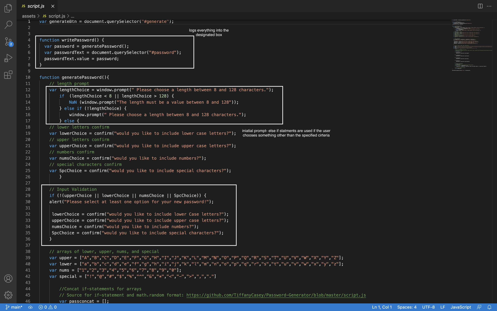

# Homework: 03-Password Generator 🔑

* Name: Honore Nelson
* Date: December 17 2021
* Weblink: https://matisses-goldfish.github.io/password-generator/


## My Task (reference)

This week’s homework requires you to modify starter code to create an application that enables employees to generate random passwords based on criteria that they’ve selected. This app will run in the browser and will feature dynamically updated HTML and CSS powered by JavaScript code that you write. It will have a clean and polished, responsive user interface that adapts to multiple screen sizes.

## Acceptance Criteria (reference)

```
GIVEN I need a new, secure password
WHEN I click the button to generate a password
THEN I am presented with a series of prompts for password criteria
WHEN prompted for password criteria
THEN I select which criteria to include in the password
WHEN prompted for the length of the password
THEN I choose a length of at least 8 characters and no more than 128 characters
WHEN asked for character types to include in the password
THEN I confirm whether or not to include lowercase, uppercase, numeric, and/or special characters
WHEN I answer each prompt
THEN my input should be validated and at least one character type should be selected
WHEN all prompts are answered
THEN a password is generated that matches the selected criteria
WHEN the password is generated
THEN the password is either displayed in an alert or written to the page
```

##Steps:
1. Pseudocode-
* A large step of creating comprehensive JavaScript is learning how to Pseudocode. Pseudocode not only allowed me to create a step by step process of what exactly I needed to inclde in my JavaScript to create  working functions. 

2. Research-
* Seeing all the Pseudocode, I was able to research similar projects and design features on sites such as Stack Overflow, MDN, and GitHub. From there, I was able to apply certain concepts to my JavaScript to make my code more compact and efficent. Concept examples: concat, input validation format, and Math.random

    > EX: I had a dificult time drafting a concept for taking my vers and creating the finished password product. I decided to look through past samples of similar projects to see how I could include my concats in my math.random portion of the project. I was able to use that concept and apply it to my own code. (source credit is below and commented in my code.)

3. Apply-
* Following my research and Pseudocode, I applied my understanding of what needed to occur with the given prompt and worked from there.

4. Debugging- 
* From there, I went through my code and tested certain functions, to which I responsed and found errors and solutions that could improve and enhance my working javascript. 

## JavaScript 



### Sources: 
* https://stackoverflow.com/questions/59340866/random-password-generator-javascript-not-working
* https://developer.mozilla.org/en-US/docs/Web/JavaScript/Reference/Global_Objects/Math/random
* https://developer.mozilla.org/en-US/docs/Web/JavaScript/Reference/Global_Objects/NaN
* https://developer.mozilla.org/en-US/docs/Web/JavaScript/Reference/Global_Objects/Array/concat
* Tiffany Casey- https://github.com/TiffanyCasey/Password-Generator

